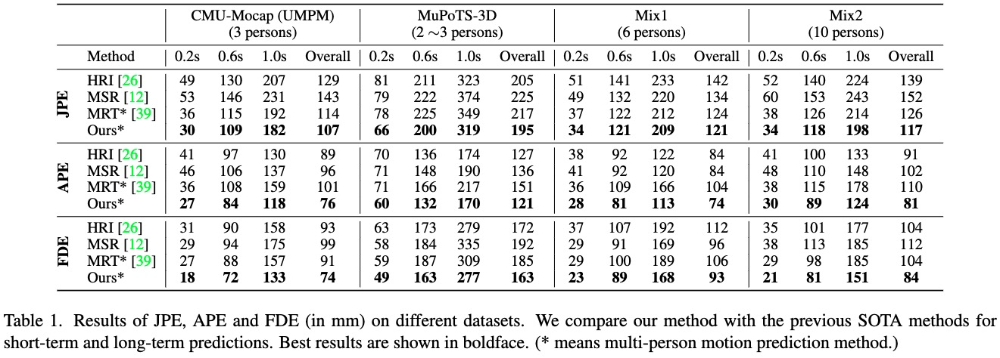
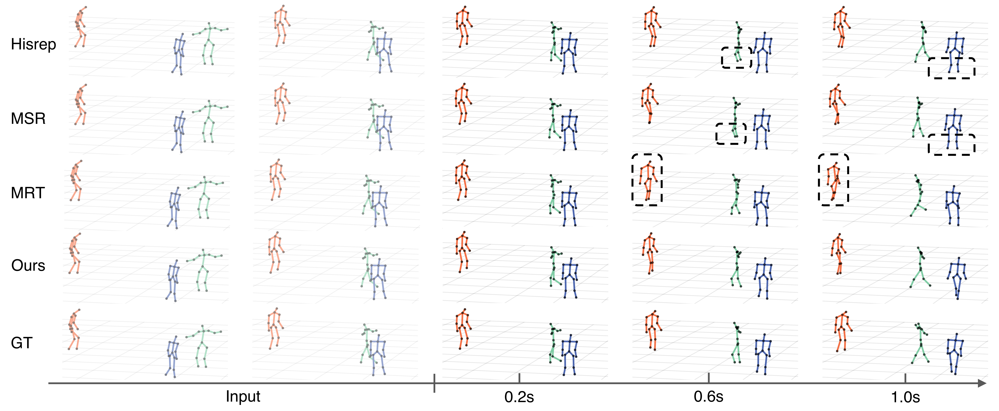

# TBIFormer
> Trajectory-Aware Body Interaction Transformer for Multi-Person Pose Forecasting  
> [Xiaogang Peng](https://xiaogangpeng.github.io/), Siyuan Mao, [Zizhao Wu*](http://zizhao.me)

<a href="https://openaccess.thecvf.com/content/CVPR2023/papers/Peng_Trajectory-Aware_Body_Interaction_Transformer_for_Multi-Person_Pose_Forecasting_CVPR_2023_paper.pdf"></a> \|
<a href="http://xiaogangpeng.github.io/projects/tbiformer/page.html"></a> \| 
<a href="https://youtu.be/iyf1kzpRiHs"></a>
<a ></a>
<br>

## News
- [2023/2/28]: Our paper is accepted by CVPR 2023. Thanks to my collaborators！
- [2023/4/20]: Initial code releases. 


## Abstract
Multi-person pose forecasting remains a challenging problem, especially in modeling fine-grained human body interaction in complex crowd scenarios. Existing methods typically represent the whole pose sequence as a temporal series, yet overlook interactive influences among people based on skeletal body parts. In this paper, we propose a novel Trajectory-Aware Body Interaction Transformer (TBIFormer) for multi-person pose forecasting via effectively modeling body part interactions. Specifically, we construct a Temporal Body Partition Module that transforms all the pose sequences into a Multi-Person Body-Part sequence to retain spatial and temporal information based on body semantics. Then, we devise a Social Body Interaction Self-Attention (SBI-MSA) module, utilizing the transformed sequence to learn body part dynamics for inter- and intra-individual interactions. Furthermore, different from prior Euclidean distance-based spatial encodings, we present a novel and efficient Trajectory-Aware Relative Position Encoding for SBI-MSA to offer discriminative spatial information and additional interactive clues. On both short- and long-term horizons, we empirically evaluate our framework on CMU-Mocap, MuPoTS-3D as well as synthesized datasets (6 ~ 10 persons), and demonstrate that our method greatly outperforms the state-of-the-art methods.

## Overview 
Pipeline:

<p align='center'>

</p>

Prediction Results:
<p align='center'>

</p>
<p align='center'>

</p>


## Prepare Data
We mostly follow the preprocessing procedure of [MRT](https://github.com/jiashunwang/MRT) for mixing dataset. Due to the mixing has random operations, we have uploaded the mixed dataset and others for your convenience and fair comparision. The datasets can be downloade from [](https://1drv.ms/f/s!AkH2L7J4yj6XgSddjwp3QwPe0iFB?e=RYJKZm). Please prepare the data like this:
```
project_folder/
├── checkpoints/
│   ├── ...
├── data/
│   ├── Mocap_UMPM
│   │   ├── train_3_75_mocap_umpm.npy
│   │   ├── test_3_75_mocap_umpm.npy
│   │   ├── test_3_75_mocap_umpm_shuffled.npy
│   ├── MuPoTs3D
│   │   ├── mupots_150_2persons.npy
│   │   ├── mupots_150_3persons.npy
│   ├── mix1_6persons.npy
│   ├── mix2_10persons.npy
├── models/
│   ├── ...
├── utils/
│   ├── ...
├── train.py
├── test.py
```
<!-- You can generate occupancy labels with or without semantics (via acitivating --with semantic). If your LiDAR is high-resolution, e.g. RS128, LiVOX and M1, you can skip Poisson reconstruction step and the generation processe will be very fast! You can change the point cloud range and voxel size in config.yaml. -->

## Training
```
python train.py
```
## Inference
```
python test.py
```

## Requirements
<a href="https://pytorch.org/get-started/locally/"></a> <br>
<a href="https://pytorch.org/get-started/locally/"></a> <br>
<a href="https://pytorch.org/get-started/locally/"> </a> </br>
<a href="https://pytorch.org/get-started/locally/"> </a> </br>
<a href="https://pytorch.org/get-started/locally/"> </a> </br>
<a href="https://pytorch.org/get-started/locally/"> </a> </br>
<a href="https://pytorch.org/get-started/locally/"> </a> </br>


## Acknowledgement
Many thanks to the previous projects:
- [MRT](https://github.com/jiashunwang/MRT)
- [HRI](https://github.com/wei-mao-2019/HisRepItself)
- [MSR](https://github.com/Droliven/MSRGCN)

Related Projects:
- [iRPE](https://github.com/microsoft/Cream/tree/main/iRPE) (orignal code of piecewise index fuction)


## Bibtex
If this work is helpful for your research, please consider citing the following BibTeX entry.

```
@InProceedings{peng2023trajectory,
        author    = {Peng, Xiaogang and Mao, Siyuan and Wu, Zizhao},
        title     = {Trajectory-Aware Body Interaction Transformer for Multi-Person Pose Forecasting},
        booktitle = {Proceedings of the IEEE/CVF Conference on Computer Vision and Pattern Recognition (CVPR)},
        month     = {June},
        year      = {2023},
        pages     = {17121-17130}
}
```

## License
Our code is under MIT protocol.
